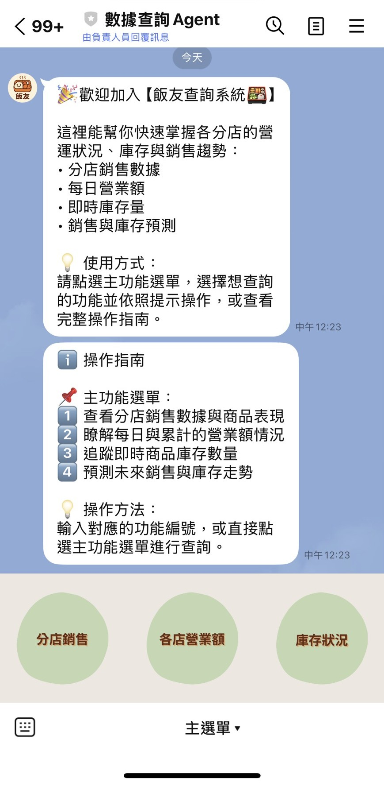
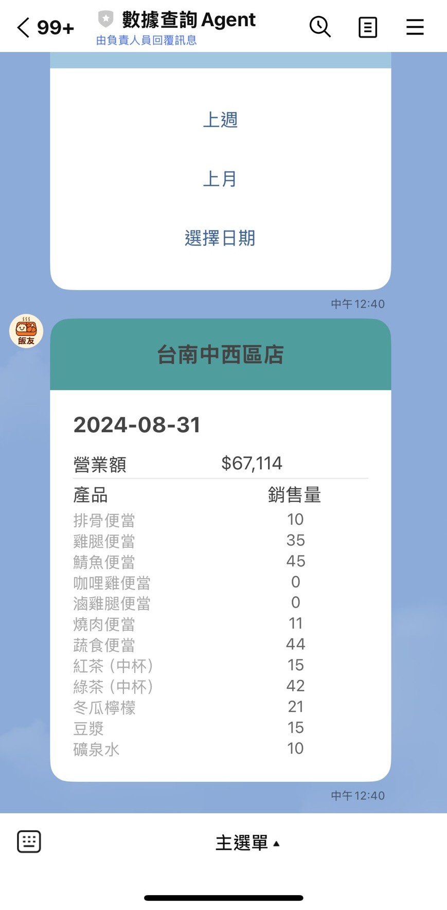
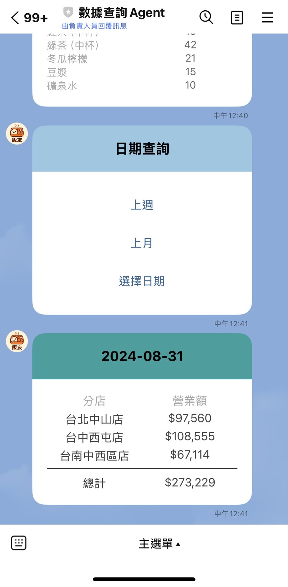

# SearchAgent0818

這是一個用於查詢**連鎖便當店營運狀況**的LINEBot，包含主程式、設定檔、工具函數、圖片以及 Docker，並部署至Google Cloud實現24小時運作。

```bash
├── main.py              # 主程式入口
├── config.py            # 設定檔（環境變數、密碼等）
├── utils/               # 工具函數模組
│              
├── images/              # 圖片資源
│ 
├── Dockerfile           # Docker 建置檔
├── requirements.txt     # Python 依賴套件
└── README.md            # 專案說明文件
```

## 畫面
<p align="center">
  
  
  
  
</p>

## 功能總覽

|操作|流程|內容| 
|------------|----------|--------|
|首次加入好友|無|歡迎訊息 + 使用指南|  
|收到文字訊息|無|使用指南|  
|點選主選單  - 分店查詢 |選分店 -> 選時間 -> 結果|營業額、各商品銷售量|
|點選主選單  - 各店營業額 |選時間 -> 結果|各分店營業額、全部總營業額|
|點選主選單  - 庫存查詢 |選分店 -> 結果|該分店與總店的各商品即時庫存量|

## 工具函數模組
> user_message.py

歡迎訊息、使用指南
> sheetdata.py

將三張表合成同個dataframe，方便取用
> setting_datetime.py

> setting_richmenu.py

> richmenu_UL_function.py

> richmenu_UM_function.py

> richmenu_UR_function.py


## 設定檔
1. 設定今天日期  
   - (預設) 2024/9/1
2. 從google secret manger匯入  
   - (Line) access_token
   - (Line) secret
   - (GooglesheetAPI) SERVICE_ACCOUNT_JSON

## 專案技術
- **line-bot-sdk** v3
- **flask**
- **gunicorn**
- **google-cloud**

## 第三方服務
- LINE BOT
- GOOGLE CLOUD 
  - GoogleSheet API
  - Google Secret Manager
  - Cloud RUN
