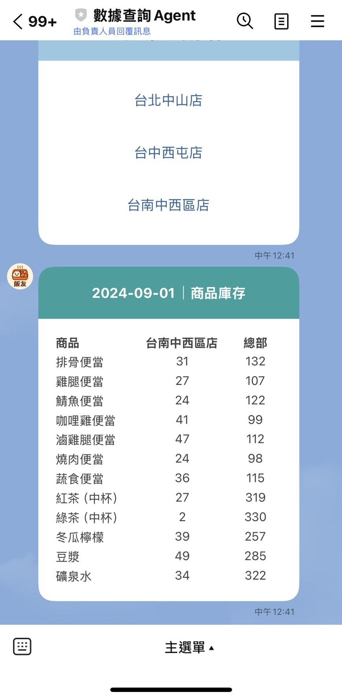

# SearchAgent0818

這是一個用於查詢**連鎖便當店營運狀況**的LINEBot，包含主程式、設定檔、工具函數、圖片以及 Docker，並部署至Google Cloud實現24小時運作。

```bash
├── main.py              # 主程式入口
├── config.py            # 設定檔（環境變數、密碼等）
├── utils/               # 工具函數模組
│              
├── images/              # 圖片資源
│ 
├── Dockerfile           # Docker 建置檔
├── requirements.txt     # Python 依賴套件
└── README.md            # 專案說明文件
```

## 畫面
<p align="center">
  
  
  
  
</p>

## 功能總覽

|操作|流程|內容| 
|------------|----------|--------|
|首次加入好友|無|歡迎訊息 + 使用指南|  
|收到文字訊息|無|使用指南|  
|點選主選單  - 分店查詢 |選分店 -> 選時間 -> 結果|營業額、各商品銷售量|
|點選主選單  - 各店營業額 |選時間 -> 結果|各分店營業額、全部總營業額|
|點選主選單  - 庫存查詢 |選分店 -> 結果|該分店與總店的各商品即時庫存量|

## 工具函數模組
> user_message.py

1. 歡迎訊息
2. 使用指南
> sheetdata.py

1. 資料處理轉為dataframe，方便取用
2. 合併每日營業額、每日商品銷售量的資料表
> setting_datetime.py

1. 定義時間範圍 (周、月)
> setting_richmenu.py
1. 設定主選單(圖片、功能數量、回傳參數)
2. 設定各功能的流程參數
> richmenu_UL_function.py
1. 分店查詢
> richmenu_UM_function.py
1. 各店營業額
> richmenu_UR_function.py
1. 庫存查詢

## 設定檔
> config.py
1. 設定今天日期  
   - (預設) 2024/9/1
2. 從google secret manger匯入  
   - (Line) access_token
   - (Line) secret
   - (GooglesheetAPI) SERVICE_ACCOUNT_JSON
## 雲端佈屬
```
Step1:啟用API服務
```
- GooglesheetAPI
- Secret Manager API
- Cloud Run Admin API
```
Step2:安全性 -> Secret Manager
```
新增密碼由google託管
- LINE_CHANNEL_ACCESS_TOKEN
- LINE_CHANNEL_SECRET
- SERVICE_ACCOUNT_JSON
```
Step3:Cloud run -> 服務
```
**先將此專案下載放進自己的github**  
**Cloud Run建立服務並完成以下設定即可建立**
- 選擇連結存放區 ->設定Cloud Build->連接自己的專案
- 填寫設定 ->服務名稱、地區
- 驗證 ->選允許公開存取
     
```
Step4:Cloud run -> 服務 -> LINE Developers
```
在該專案找到『服務網址』複製  
貼上**Webhook URL**並按 [vertify] 驗證 success則成功  
(LINE Developers ->已建立的LINEBOT ->Messaging API-> Webhook settings)

## 專案技術
- line-bot-sdk
- flask
- gunicorn
- google-cloud

## 第三方服務
- LINE BOT
- GOOGLE CLOUD 
  - GoogleSheet API
  - Google Secret Manager
  - Cloud RUN
